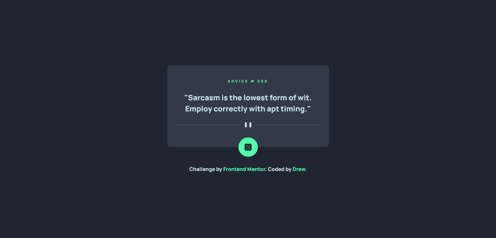

# Frontend Mentor - Advice generator app solution

This is a solution to the [Advice generator app challenge on Frontend Mentor](https://www.frontendmentor.io/challenges/advice-generator-app-QdUG-13db). Frontend Mentor challenges help you improve your coding skills by building realistic projects.

## Table of contents

- [Overview](#overview)
  - [The challenge](#the-challenge)
  - [Screenshot](#screenshot)
  - [Links](#links)
- [My process](#my-process)
  - [Built with](#built-with)
  - [What I learned](#what-i-learned)
  - [Continued development](#continued-development)
  - [Useful resources](#useful-resources)
- [Author](#author)
- [Acknowledgments](#acknowledgments)


## Overview

### The challenge

Users should be able to:

- View the optimal layout for the app depending on their device's screen size
- See hover states for all interactive elements on the page
- Generate a new piece of advice by clicking the dice icon

### Screenshot




### Links

- Solution URL: [Click Here](https://github.com/24FContreras/FM-adviceGeneratorApp)
- Live Site URL: [Click Here](https://24fcontreras.github.io/FM-adviceGeneratorApp/)

## My process

### Built with

- Semantic HTML5 markup
- CSS and SCSS
- Flexbox
- Mobile-first approach
- Vanilla JS
- Fetch with Async Await functions


### What I learned

This challenge was a nice reminder to work with vanilla js and making fetch requests. For this I used async/await functions to fetch advice data.

```js
const fetchAdvice = async () => {
  const res = await fetch("https://api.adviceslip.com/advice");
  const data = await res.json();
};
```

### Continued development

After this, I'm going to keep working on Frontend Mentor Javascript projects in both newbie and junior categories, and even more complex challenges in the upper categories as well. Let's keep going!

## Author

- Frontend Mentor - [@24FContreras](https://www.frontendmentor.io/profile/24FContreras)
- Github - [@24FContreras](https://github.com/24FContreras)
- Discord - Tealshark#0029